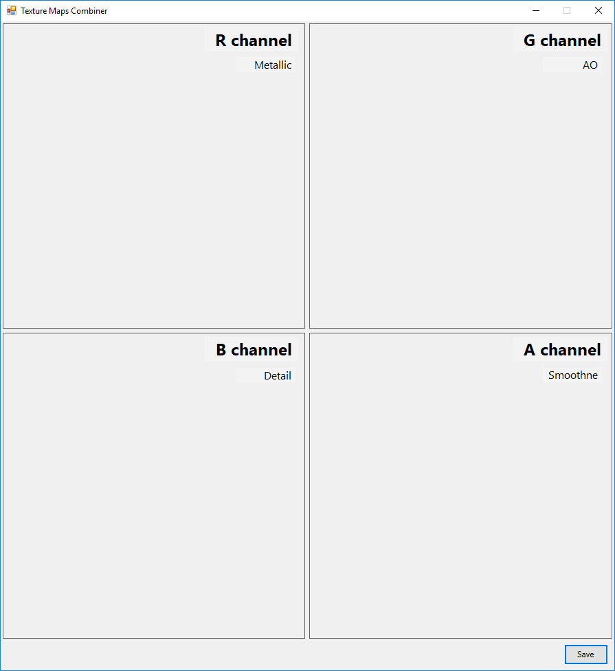

# Texture Map Combiner
.NET WinForm application for combining multiple textures into one file (R, G, B, A one for each texture)

Drag & drop texture files into corresponding boxes and save as one merged PNG file.

